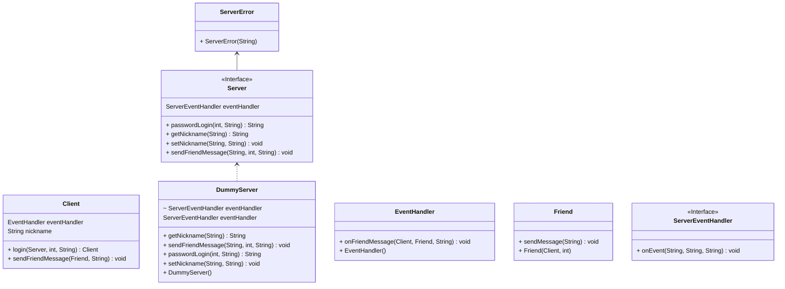

# SimpleIMBot

这个项目以即时聊天软件中的机器人为例，展示了 Java 语言的面向对象编程的一些特性。

## 结构

项目分为客户端和服务器两部分。

客户端主要为 `Client` 类，这个类模拟了即时聊天软件的无头客户端，提供了机器人操作客户端的接口。

服务器主要为 `Server` 接口，这个接口模拟了即时聊天软件的服务器。服务器的实现类为 `DummyServer`，这个类模拟了一个简单的服务器，提供了机器人操作服务器的接口。

`EventHandler` 是客户端处理服务器消息的抽象基类，机器人在实现时，需要继承并实现其中的方法，以处理服务器发来的消息。

## UML 类图

